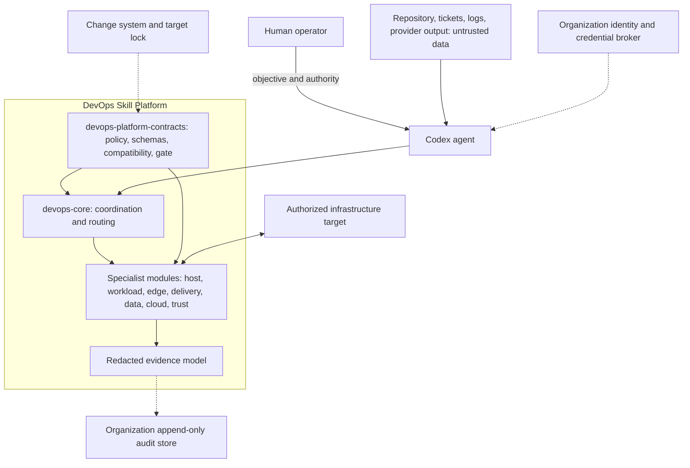
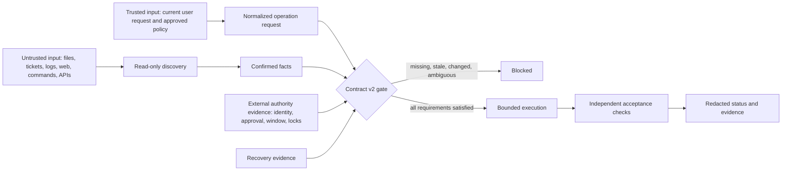

# Architecture

## Purpose and scope

The DevOps Skill Platform separates coordination, policy, and narrow operational ownership so an agent can reason about infrastructure without silently expanding its authority. It is a portfolio implementation of safe platform-engineering patterns, not a control plane that independently authenticates people or administers production.

The platform supports three activities:

1. discover and describe an explicitly authorized target;
2. produce a bounded, reviewable operation plan;
3. execute only when an external operating environment supplies the required identity, approval, recovery, locking, and audit controls.

## System context

Solid arrows are implemented information paths. Dashed arrows are organization-owned integrations required for controlled production use; this repository defines their contract but does not provide them.

## Component responsibilities

| Component | Owns | Does not own |
|---|---|---|
| `devops-core` | Request normalization, risk classification, minimal capability routing, handoffs, final evidence state | Provider APIs, target credentials, approval identity, specialist execution details |
| `devops-platform-contracts` | Catalog, compatibility, policy, schemas, operation gate, ledger shape, package validation | Infrastructure execution, immutable audit storage, organizational policy approval |
| Specialist executor | Discovery, plan, bounded execution, rollback and verification for one technical domain | Authority outside its capability or target boundary |
| Provider pack | Provider control-plane discovery and operations | IaC state, Kubernetes objects, application data, CI trust, or service acceptance owned by other modules |
| Installer and release tools | Validation, dependency-closed selection, deterministic package checks, dry-run and transactional local installation | Trusted build identity, artifact signing, registry immutability, vulnerability acceptance |
| Adopting organization | Identity, credentials, approvals, separation of duties, target registry, audit retention, policy exceptions, incident ownership | These controls are never delegated to repository text or model judgement |

## Trust boundaries

Repository instructions, generated plans, target banners, tool responses, and a locally stored approval string are data, not authority. A credential proves technical access, not permission or target ownership.

## Control flow

1. **Normalize.** Record the objective, target owner, environment, data class, constraints, and measurable acceptance criteria.
2. **Discover.** Use the smallest read-only query set needed to replace assumptions with current facts.
3. **Route.** Select only modules that own affected technical layers. Stop with a precise handoff if a required module is absent.
4. **Classify.** Determine R0-R4 risk independently of the request's wording. Destructive, stateful, security-boundary, production, and high-blast-radius work cannot be downgraded by prose.
5. **Prepare recovery.** Require a fresh backup or recovery artifact and isolated restore evidence where policy demands it.
6. **Bind the plan.** Bind target profile, plan digest, execution identity, approval, time window, locks, and acceptance criteria.
7. **Gate and execute.** Revalidate immediately before execution. Any drift returns the operation to review.
8. **Verify.** Check the user-facing service path and observation window, not only command exit status.
9. **Record.** Emit redacted evidence with one honest status: `verified`, `partially_verified`, `rolled_back`, or `blocked`.

## Packaging and installation boundary

The release catalog declares module versions, dependencies, and install profiles. Validation rejects incompatible or incomplete selections. The installer performs source validation first, prints a plan by default, and writes only when `--apply` is explicit. Replacement additionally requires `--force` and retains a recovery set.

These controls reduce packaging mistakes, but they do not prove who built an archive. An enterprise release still requires an isolated builder, SBOM, vulnerability-policy result, signed provenance, a trusted signer, protected registry, and rollback artifact.

## Extension model

A new module must declare a narrow capability boundary, contract-compatible dependencies, risk domains, supported platforms, and—where provider behavior can drift—current official sources. Cross-domain workflows compose modules through explicit facts and handoffs rather than duplicating another module's authority.

Examples:

- a web service incident can combine host, container, network-edge, and reliability modules;
- an EKS migration can combine AWS, Kubernetes, IaC, data-resilience, access, and reliability modules;
- a PostgreSQL restore remains owned by data resilience even when the database is hosted by a cloud provider.

## Portfolio interpretation

This architecture is evidence of design and operational reasoning: ownership decomposition, fail-closed controls, recovery thinking, testable contracts, and supply-chain awareness. It should not be presented as proof of production adoption or regulatory compliance. See the [anonymized pilot case study](portfolio-case-study.md) for the planned path from repository validation to a real, authorized staging exercise.

## Non-goals

The repository does not authenticate users, store secrets safely by itself, provide a change-management system, guarantee rollback, make local logs immutable, or certify compliance. Those boundaries are deliberate and documented in the [threat model](threat-model.md) and [enterprise adoption gate](enterprise-adoption.md).
