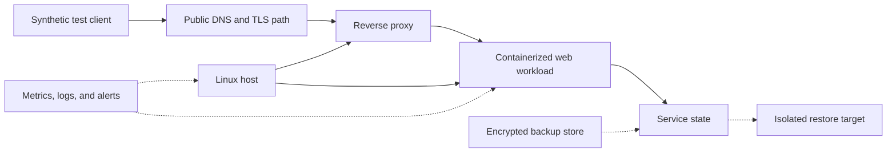

# Portfolio pilot case study

## Status and publication boundary

This is a **planned, anonymized pilot**, not a completed production case study. The candidate environment is a friend-operated small hosting/service environment. Public attribution may use the operator's real name only after explicit permission from its owner has been recorded.

Public evidence must not contain domains, IP addresses, hostnames, account or tenant identifiers, credential references, customer data, private topology, raw logs, or screenshots that reveal them. Redacted or synthetic examples must remain clearly labelled as such.

## Why this is a useful pilot

A small hosting service is realistic enough to exercise core sysadmin and DevOps responsibilities while keeping scope reviewable:

- Linux host inventory and hardening;
- Docker or Compose workload discovery;
- DNS, TLS, reverse-proxy, and public service-path checks;
- backups plus an isolated restore test;
- monitoring, actionable alerts, and an evidence-led incident path;
- a reviewed deployment with measurable acceptance criteria and rollback.

The pilot is intended to demonstrate controlled operations, not to maximize automation or obtain broad administrator access.

## Pilot question

Can the platform produce a current, redacted service inventory and a safe improvement plan, then validate one authorized staging change without exposing secrets or treating repository content as authority?

## Scope and success criteria

| Stage | Allowed activity | Evidence required to claim success |
|---|---|---|
| Local evaluation | Validate repository and preview an install | Validator output and dry-run plan; no target connection |
| Observe | Read-only discovery on one owner-approved non-production target | Time-bounded authorization, redacted inventory, commands used, data-handling review |
| Assist | Draft hardening, backup, monitoring, deployment, and rollback plans | Peer-reviewed plan, risk class, dependencies, acceptance criteria, unresolved assumptions |
| Controlled staging | Execute one reversible R1/R2 change with scoped short-lived access | Exact plan digest, approval, lock, preflight, rollback path, verification output, observation window |
| Production | Out of scope for the portfolio demo by default | Separate owner decision and the relevant [adoption-gate](enterprise-adoption.md) controls |

A stage is `verified` only when its evidence is captured and redacted. Otherwise it remains `partially_verified` or `blocked`; a successful command alone is not completion.

## Candidate service model

This diagram is intentionally generic. Actual topology is discovered only with owner authorization and stays in the private operations workspace.

## Shipped synthetic demo

The repository includes a [safe change-control demo](../examples/portfolio-demo/README.md) that is reproducible without production credentials or network access. It runs this local path:

`synthetic audit -> immutable plan digest -> exact approval gate -> local simulation -> verification -> rollback drill`

The demo:

1. validates a synthetic target profile and audit fixture;
2. rejects an approval bound to the wrong plan digest;
3. accepts approval bound to the exact target, plan, policy, and execution window;
4. allows execution only when the fixture declares the complete simulation-only boundary;
5. verifies the simulated immutable release and health state;
6. injects a health failure and confirms that rollback restores the exact pre-change state.

This proves the repository's synthetic control path, not a production deployment, real restore, availability level, security certification, or organization-specific approval process. A terminal recording remains a useful presentation enhancement, but the executable demo, fixtures, and tests are shipped.

## Live pilot sequence

If the owner approves a real staging exercise, perform it in this order:

1. record written scope, target ownership, maintenance window, contacts, and stop conditions;
2. use short-lived least-privilege access on a non-production target;
3. collect only the minimum read-only facts needed for inventory;
4. agree on measurable service checks and alert ownership;
5. create and independently test a recovery path before any stateful change;
6. review the exact plan and obtain identity-backed approval;
7. execute one reversible staging change;
8. verify the synthetic user path through DNS/TLS/proxy/workload and observe it for the agreed window;
9. export a redacted evidence bundle and revoke access.

No step authorizes production access, customer-data access, or unrelated remediation.

## Evidence register

| Evidence item | Public representation | Current status |
|---|---|---|
| Platform and dependency validation | Validator summary without local paths | Available locally; publish with the release workflow |
| Installer behavior | `web-linux` dry-run transcript | Reproducible from the source checkout |
| Synthetic request and target profile | Sanitized fixture | Shipped in `examples/portfolio-demo` |
| Fail-closed operation-gate result | Reproducible test output | Shipped; mismatched digest is rejected |
| Simulated verification and rollback | Reproducible test output | Shipped; injected health failure restores pre-change state |
| Live read-only inventory | Aggregated, owner-reviewed summary | Not started; requires authorization |
| Restore exercise | Metrics and outcome without infrastructure identifiers | Not started; requires isolated target and owner approval |
| Staging deployment and rollback | Redacted plan, checks, observation result | Not started; requires prior stages |

## Honest portfolio wording

Recommended wording after publishing the repository:

> Designed and validated a 20-module DevOps skill platform with capability-based routing, fail-closed change gates, deterministic packaging, recovery requirements, and evidence-led verification.

Add a pilot outcome only after it happened and the evidence was reviewed. Replace general claims with measured facts such as the number of inventoried services, restore duration, alert coverage, or rollback time. Do not imply endorsement by the operator, enterprise certification, or production deployment.

## Risks and decisions still owned by the operator

The operator retains authority over target access, credential issuance, production changes, maintenance windows, customer-data handling, backup retention, alert recipients, incident response, and publication of the service name. The repository cannot make those decisions on the operator's behalf.
